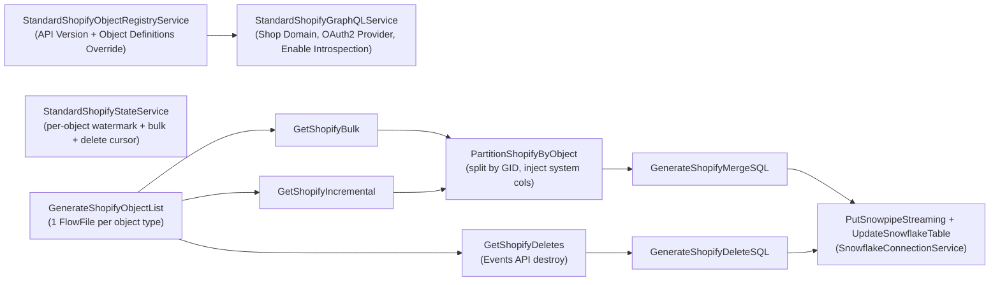

<!--
MAINTAINER NOTE:

This file is routed from two locations (keep both in sync with the in-repo copy at
runtime-extensions/.cursor/skills/openflow/references/connector-shopify.md):

1. connector-main.md — "Connectors with Specific Documentation" table:
   | Shopify, Shopify store, e-commerce | `shopify-connector` | `references/connector-shopify.md` |

2. SKILL.md — Reference Index under "Connector Operations":
   | `references/connector-shopify.md` | Shopify connector (OAuth2 client credentials auth, registry-driven objects, Object Definitions Override, deletes) |
-->

# Shopify Connector

The Openflow Connector for Shopify replicates data from a Shopify store into Snowflake using the Shopify Admin GraphQL API. It uses Shopify Bulk Operations for the initial load, timestamp-based
incremental polling for ongoing changes, and the Shopify Events API for soft-delete detection. Data is loaded into Snowflake using Snowpipe Streaming.

The connector is **registry-driven**: it ships with a built-in catalogue of common object types, and any other Shopify Admin GraphQL object can be added at runtime via the `Object Definitions Override`
parameter (JSON) or auto-discovered through GraphQL introspection — no code change or release required.

**Note:** These operations modify service state. Apply the Check-Act-Check pattern from `references/core-guidelines.md`.

## Critical (read first)

- **Validate any `Object Definitions Override` JSON before applying it** — it must be valid JSON and a top-level array. Invalid JSON makes the `StandardShopifyObjectRegistryService` INVALID and **the
  connector fails to start**. See [Adding New Objects](#adding-new-objects-object-definitions-override).
- **Grant a matching Admin API read scope for every object** in `Objects to Sync` (e.g. `read_orders` for `orders`). A missing scope yields empty results or access errors for that object only.
- **`read_orders` only returns the last 60 days by default.** To backfill full order history (and the `transactions` and fulfillment records tied to orders), the app must also be granted **`read_all_orders`**, which requires a Shopify access request (raised from the app's **API access** settings in the Dev Dashboard). Without it, the initial bulk load silently omits older orders.
  See [Configure Admin API Scopes](#step-2-configure-admin-api-scopes).
- **Never hallucinate `graphqlFields`.** Every field must be verified to exist (and not be deprecated) on the object's type in the Admin **GraphQL** reference for the configured API version — the **REST** API's field names are invalid here and must never be used. When in doubt, ask the user.
  See [Building graphqlFields safely](connector-shopify/connector-shopify-objects.md#building-graphqlfields-safely-verify-against-the-admin-graphql-reference).
- **First run is bulk-then-incremental** per object. `GetShopifyIncremental` routes to retry until the one-time bulk load for that object completes — this is expected; let bulk finish.
- **Schema evolution is not supported.** If a Shopify object's fields change, reset that object's state and drop its tables to re-snapshot (see [Reset an Object](#reset-replication-for-one-object)).
- **Authentication is OAuth2 client_credentials** using a Shopify **dev app**. The connector fetches Admin API tokens from `https://<shop>.myshopify.com/admin/oauth/access_token` using `Shopify Client ID` + `Shopify Client Secret` and refreshes them automatically. This is the only supported auth path — always use it for new deployments. Three-legged merchant OAuth (interactive install per merchant) is not supported.
- **Never display sensitive values** (`Shopify Client Secret`, private keys) — use `[REDACTED]` in confirmations.

## Common Tasks

| User intent                               | Go to                                                                                                                   |
|-------------------------------------------|-------------------------------------------------------------------------------------------------------------------------|
| "Set up / deploy the Shopify connector"   | [Workflow Summary](#workflow-summary) → [Deployment Workflow](#deployment-workflow)                                     |
| "Get a Shopify Client ID / Secret" / auth setup | [Shopify Prerequisites](#shopify-prerequisites)                                                                         |
| "Which objects can I sync?"               | [Supported Objects](#supported-objects-and-limitations)                                                                 |
| "Sync an object that isn't in the list"   | [Adding New Objects](#adding-new-objects-object-definitions-override) / [Auto-discovery](#auto-discovery-introspection) |
| "Configure parameters"                    | [Parameters](#parameters)                                                                                               |
| "Capture deletes"                         | [How Deletes Are Handled](#how-deletes-are-handled)                                                                     |
| "It's not working / no data / errors"     | [Troubleshooting](#troubleshooting)                                                                                     |
| "Re-sync one object from scratch"         | [Reset an Object](#reset-replication-for-one-object)                                                                    |
| "Deploy to many shops" / fleet            | [Deploying many shops (fleet)](#deploying-many-shops-fleet)                                                             |
| "Access-denied error on one field"        | [Fields that require a write scope to read](connector-shopify/connector-shopify-objects.md#fields-that-require-a-write-scope-to-read)     |

## Scope

This reference covers:

- Shopify dev app + OAuth2 client_credentials authentication
- Connector parameter configuration (source, destination, scheduling)
- The registry architecture and how to add new object types via `Object Definitions Override`
- Auto-discovery (introspection), deletes (Events API), rate limiting
- Deployment workflow, validation, and troubleshooting

For other connectors, see `references/connector-main.md`.

## Workflow Summary

Complete these steps in order:

> **⚠️ STOP — confirm `Objects to Sync` with the user before requesting Admin API scopes.** Each object requires a matching read scope and (for `orders`) potentially a Shopify access request, so the object list drives the prereq work — do not pick it for them.

1. **Shopify Prerequisites** — Create a Shopify dev app, grant Admin API read scopes, release, install on the store, copy the **Client ID** and **Client Secret**
2. **Snowflake Prerequisites** — Destination database + schema exist; role has CREATE on the schema; warehouse granted
3. **Network Access** — EAI attached to runtime (SPCS only) for `*.myshopify.com` (also serves the OAuth2 token endpoint)
4. **Deploy** — Deploy the connector flow (`shopify-connector`)
5. **Parameters** — Configure Shopify, destination, ingestion, and scheduling parameters
6. **Verify Controllers** — Run `verify_config` (validates the Shopify connection by loading shop info; also exercises the OAuth2 token endpoint)
7. **Enable Controllers** — Enable after verification passes
8. **Verify Processors** — Run `verify_config` after controllers enabled
9. **Start** — Start the flow
10. **Validate** — Confirm bulk load completes, then incremental + deletes flow

> **⚠️ STOP — after starting, confirm the initial bulk load for every object has completed (status `BULK_COMPLETED`, rows present) before treating incremental as the source of truth.**

**Common failures:** Missing Admin API scopes on the dev app (the app returns empty results or access-denied errors for the affected object type); OAuth2 token request failing because the app was not released, was uninstalled, or the Client ID/Secret don't match the dev app's `Settings → Credentials` values.

See [Deployment Workflow](#deployment-workflow) for detailed instructions.

## Output

The end state is a deployed, verified, and **running** Shopify connector: the configured objects (and their child tables) exist in the destination Snowflake schema, partitioned by `SHOP_URL`, populated by the initial bulk load and then kept current by incremental sync and — for supported objects — Events-API soft-deletes.

---

## Architecture



**Sync architecture:**

1. **Initial load** — `GetShopifyBulk` submits `bulkOperationRunQuery`, polls until COMPLETE, downloads JSONL.
2. **Ongoing** — `GetShopifyIncremental` polls `updated_at:>'<watermark>'` with cursor pagination.
3. **Deletes** — `GetShopifyDeletes` polls the Events API for `action: destroy` and applies soft-deletes.

**Destination pattern:** Multiple shops can write to one Snowflake schema, partitioned by `SHOP_URL`. Records are loaded into a staging table via Snowpipe Streaming, then merged into the target on the
compound key `(ID, SHOP_URL)`.

---

## Collect Checklist

Gather this information from the user **before** proceeding with deployment.

### Shopify Source (Required)

| Item                         | Example                                                                                                                                          | Collected |
|------------------------------|--------------------------------------------------------------------------------------------------------------------------------------------------|-----------|
| Shop Domain                  | `my-store.myshopify.com` (the `.myshopify.com` domain, not a custom domain)                                                                      | [ ]       |
| Shopify Client ID            | Dev app **Settings → Credentials** → Client ID                                                                                                   | [ ]       |
| Shopify Client Secret        | Dev app **Settings → Credentials** → Client Secret (sensitive)                                                                                   | [ ]       |
| Admin API scopes granted     | `read_orders`, `read_products`, `read_customers`, `read_inventory`, etc. — one per object synced (plus `read_all_orders` for full order history) | [ ]       |
| App released and installed   | Dev-app builds only take effect after **Release**; the app must be **Installed** on the store to authenticate                                    | [ ]       |
| Shopify API Version          | `2026-04` (quarterly format `YYYY-(01\|04\|07\|10)`)                                                                                             | [ ]       |
| Objects to Sync              | **Always ask the user — do not enumerate the bundled registry.** If the user has no preference, propose the default (`orders,products,customers,productVariants,inventoryItems,collections`) and confirm before deploying. | [ ]       |
| Objects to Track for Deletes | subset of objects that emit destroy events (e.g. `products,customers,collections`)                                                               | [ ]       |
| Object Definitions Override  | Optional JSON for objects not in the built-in catalogue                                                                                          | [ ]       |

### Snowflake Destination (Required)

| Item                         | Description                                                       | Collected |
|------------------------------|-------------------------------------------------------------------|-----------|
| Destination Database         | Must already exist (connector does not create it)                 | [ ]       |
| Destination Schema           | Must already exist                                                | [ ]       |
| Snowflake Account Identifier | `[org-name]-[account-name]` — leave blank for `SNOWFLAKE_MANAGED` | [ ]       |
| Snowflake Role               | Role with CREATE TABLE on the destination schema                  | [ ]       |
| Snowflake Warehouse          | Warehouse for query execution                                     | [ ]       |
| Authentication Strategy      | `SNOWFLAKE_MANAGED` (SPCS / managed token) or `KEY_PAIR` (BYOC)   | [ ]       |

> **⚠️ STOP — present the collected checklist to the user and get explicit confirmation before proceeding.** Do not continue until all required items are collected and prerequisites confirmed.

---

## Supported Objects and Limitations

### Built-in Catalogue (API version 2026-04)

The connector ships with definitions for these object types (`shopify-objects-2026-04.json`). `Deletes` indicates the type emits Shopify Events API destroy events.

| apiType              | Snowflake Table       | Incremental Field           | Deletes | Child Tables                                              |
|----------------------|-----------------------|-----------------------------|---------|-----------------------------------------------------------|
| `orders`             | `ORDERS`              | `updatedAt`                 | No      | `ORDER_LINE_ITEMS`, `ORDER_FULFILLMENTS`, `ORDER_RETURNS` |
| `products`           | `PRODUCTS`            | `updatedAt`                 | Yes     | `PRODUCT_OPTIONS`                                         |
| `customers`          | `CUSTOMERS`           | `updatedAt`                 | Yes     | —                                                         |
| `productVariants`    | `PRODUCT_VARIANTS`    | `updatedAt`                 | Yes     | —                                                         |
| `inventoryItems`     | `INVENTORY_ITEMS`     | `updatedAt`                 | No      | `INVENTORY_LEVELS`                                        |
| `collections`        | `COLLECTIONS`         | `updatedAt` (FULL_PERIODIC) | Yes     | —                                                         |
| `transactions`       | `TRANSACTIONS`        | (parent-piggybacked)        | No      | —                                                         |
| `tenderTransactions` | `TENDER_TRANSACTIONS` | `processedAt`               | No      | —                                                         |
| `marketingEvents`    | `MARKETING_EVENTS`    | `startedAt`                 | No      | —                                                         |
| `draftOrders`        | `DRAFT_ORDERS`        | `updatedAt`                 | No      | —                                                         |
| `pages`              | `PAGES`               | `updatedAt`                 | Yes     | —                                                         |
| `articles`           | `ARTICLES`            | `updatedAt`                 | Yes     | —                                                         |
| `blogs`              | `BLOGS`               | (none)                      | Yes     | —                                                         |
| `locations`          | `LOCATIONS`           | (none)                      | No      | —                                                         |
| `companies`          | `COMPANIES`           | `updatedAt`                 | No      | —                                                         |
| `companyLocations`   | `COMPANY_LOCATIONS`   | `updatedAt`                 | No      | —                                                         |
| `catalogs`           | `CATALOGS`            | (none)                      | No      | —                                                         |
| `priceLists`         | `PRICE_LISTS`         | (none)                      | No      | —                                                         |
| `fulfillmentOrders`  | `FULFILLMENT_ORDERS`  | `updatedAt`                 | No      | —                                                         |
| `giftCards`          | `GIFT_CARDS`          | `createdAt`                 | No      | —                                                         |
| `markets`            | `MARKETS`             | (none)                      | No      | —                                                         |
| `segments`           | `SEGMENTS`            | (none)                      | No      | —                                                         |

**Incremental Field column — what each value means for sync behavior:**

- A timestamp field (`updatedAt`, `createdAt`, `processedAt`, `startedAt`) — after the one-time initial bulk load, the object is **incrementally synced**, polling changes on that field.
- `(none)` — no incremental timestamp, so the object is **FULL_PERIODIC**: **bulk-loaded once and not incrementally updated**. To refresh it, [reset the object](#reset-replication-for-one-object) (which re-runs the bulk). Applies to `blogs`, `locations`, `catalogs`, `priceLists`, `markets`, `segments`.
- `updatedAt (FULL_PERIODIC)` — incremental is explicitly disabled even though a timestamp exists; same behavior as `(none)` (bulk once; reset to refresh). Applies to `collections`.
- `(parent-piggybacked)` — fetched as part of its **parent** object's query, **not** polled independently (no standalone sync cadence). Applies to `transactions`.

Set user expectations accordingly when selecting these object types for sync.

Any other Admin GraphQL object can be added via [Object Definitions Override](#adding-new-objects-object-definitions-override) or [auto-discovery](#auto-discovery-introspection).

### Limitations

- Requires a Shopify **dev app** with Admin API access. Authentication uses the OAuth2 `client_credentials` grant against `https://<shop>/admin/oauth/access_token` — three-legged merchant OAuth (interactive per-merchant install) is not supported.
- The Shopify Bulk Operations API allows a maximum of **5 connections** per query and at most **2 levels** of nested connections (a third nested level is rejected). `Include Metafields` consumes one connection.
- The connector supports **data extraction (ingestion) only** — no write-back to Shopify.
- **Schema evolution is not supported.** If a source object gains or loses fields, you must reset the connector state for that object to re-ingest with the updated schema (
  see [Reset an Object](#reset-replication-for-one-object)).
- Delete detection is only available for object types that emit destroy events in the Shopify Events API (the `Deletes = Yes` rows above). Other types return zero delete results.
- Child connections use `first: pageSize` (default and **max 250**) per parent on **incremental** queries — `pageSize` cannot exceed 250, the Shopify hard limit for `first:` on regular queries (a larger value is rejected with `first cannot exceed 250`). On an incremental run, a parent with more children than `pageSize` has the extras skipped; large child volumes are captured by the initial **bulk** load, which Shopify recommends (and the connector uses) for amounts beyond the per-page limit.
- **API versions are deprecated on a rolling basis.** Shopify supports each quarterly version for roughly a year, then it stops working. Plan to bump `Shopify API Version` (and review the bundled
  catalogue / any overrides for field changes) before the configured version is retired.
- Rate limits depend on the Shopify plan. Very high-volume stores with many objects may require careful scheduling to avoid sustained throttling.

---

## Official Documentation

Refer to the official Snowflake documentation for current requirements. This reference provides operational guidance and troubleshooting beyond what the docs cover.

- **Shopify Connector Overview:** [About the Openflow Connector for Shopify](https://docs.snowflake.com/en/user-guide/data-integration/openflow/connectors/shopify/about)
- **Shopify Connector Setup (dev app + OAuth2):** [Set up the Openflow Connector for Shopify](https://docs.snowflake.com/en/user-guide/data-integration/openflow/connectors/shopify/setup)
- **Shopify dev apps & client secrets:** [Client secrets](https://shopify.dev/docs/apps/build/authentication-authorization/client-secrets) — where Client ID / Client Secret come from and how they authenticate the OAuth2 token request.
- **Admin GraphQL API reference:** [shopify.dev/docs/api/admin-graphql](https://shopify.dev/docs/api/admin-graphql) — the source of truth for verifying object/query fields, arguments, and deprecations
  when building `graphqlFields` (see [Building graphqlFields safely](connector-shopify/connector-shopify-objects.md#building-graphqlfields-safely-verify-against-the-admin-graphql-reference)).
- **API access scopes reference:** [Shopify API access scopes](https://shopify.dev/docs/api/usage/access-scopes#authenticated-access-scopes) — required read scopes per object/field, plus
  `read_all_orders`.
- **Protected customer data:** [Protected customer data](https://shopify.dev/docs/apps/launch/protected-customer-data) — approval flow required for customer PII fields.
- **Bulk Operations guide:** [Bulk operations — queries](https://shopify.dev/docs/api/usage/bulk-operations/queries) — how the initial bulk load works and its limits (e.g. the 5-nested-connection
  cap).

---

## Shopify Prerequisites

These steps are performed by a Shopify Partner / developer with access to the [Shopify Dev Dashboard](https://dev.shopify.com/dashboard/) and by a store owner who installs the resulting app.

The connector authenticates via **OAuth2 client_credentials** using a Shopify **dev app** — this is the only auth path you should configure.

### Step 1: Create a Shopify Dev App

1. Log in to the [Shopify Dev Dashboard](https://dev.shopify.com/dashboard/).
2. Select **Create app** and provide an app name (e.g. `Openflow Connector`).

### Step 2: Configure Admin API Scopes

1. In the new app, open the **Access** section.
2. Select **read** scopes for every object type you intend to sync. Common mappings:

| Object                                                   | Required Scope                                                                                                                                                     |
|----------------------------------------------------------|--------------------------------------------------------------------------------------------------------------------------------------------------------------------|
| `orders`, `transactions`, order `fulfillments`           | `read_orders` (only the last 60 days unless `read_all_orders` is also granted — see below)                                                                         |
| `draftOrders`                                            | `read_draft_orders`                                                                                                                                                |
| `products`, `productVariants`, `collections`             | `read_products`                                                                                                                                                    |
| `customers`, `segments`, `companies`, `companyLocations` | `read_customers` (one scope covers all four; **protected customer data** approval is separately required for customer PII — see below)                              |
| `inventoryItems`, `locations`                            | `read_inventory`, `read_locations`                                                                                                                                 |
| `fulfillmentOrders`                                      | `read_merchant_managed_fulfillment_orders` (also `read_assigned_fulfillment_orders` / `read_third_party_fulfillment_orders` when those fulfillment types are used) |
| `pages`, `articles`, `blogs`                             | `read_content`                                                                                                                                                     |
| `marketingEvents`                                        | `read_marketing_events`                                                                                                                                            |
| `giftCards`                                              | `read_gift_cards`                                                                                                                                                  |
| `markets`                                                | `read_markets`                                                                                                                                                     |

Always confirm scopes against the [Shopify access scopes reference](https://shopify.dev/docs/api/usage/access-scopes#authenticated-access-scopes) for your API version — mappings change between
versions, and one scope often covers several objects (e.g. `read_customers` also grants `Company` and `CompanyLocation`). For objects not listed here (e.g. `catalogs`, `priceLists`), look up the required scope on the object's page in that reference rather than assuming one.

#### Scopes that need extra approval or have data limits

Some scopes can't simply be checked on — they require a Shopify access request (raised from your app's **API access** settings in the Dev Dashboard) and/or expose only a limited data window. These directly affect what the connector can replicate, so resolve them **before** the initial bulk load:

| Scope / requirement                                                | Why it matters for the connector                                                                                                                                                                                                                                                                                                                                             |
|--------------------------------------------------------------------|------------------------------------------------------------------------------------------------------------------------------------------------------------------------------------------------------------------------------------------------------------------------------------------------------------------------------------------------------------------------------|
| `read_all_orders`                                                  | `read_orders` alone returns **only orders created in the last 60 days**. To backfill the full order history (and the `transactions` and fulfillment records scoped to those orders), request **`read_all_orders`** from the app's **API access** settings in the Dev Dashboard and grant it **alongside** `read_orders`. Without it, the bulk load silently omits older orders. |
| Protected customer data                                            | Customer PII (name, address, email, phone — in `customers`, and customer fields on `orders`) is **protected customer data**. Apps receive it only after requesting protected customer data access from **API access** and meeting Shopify's data protection requirements; until approved, non-development stores return no protected fields. See [Protected customer data](https://shopify.dev/docs/apps/launch/protected-customer-data). |
| `read_customer_payment_methods`, `read_own_subscription_contracts` | Payment-method and subscription data require an access request from the Dev Dashboard before the scope can be added to the app.                                                                                                                                                                                                                                              |

### Step 3: Release the App

Dev-app changes take effect only after a **Release**.

1. Select **Release**, optionally provide a version name and message, then confirm by selecting **Release** again.
2. Every time you change scopes later, you must **release a new version** and reinstall on the store for the new permissions to take effect.

### Step 4: Install the App on the Store

1. On the app **Overview** page, select **Install app**. You are redirected to the store admin.
2. In the store, select **Install** to confirm.

An app that is not both released **and** installed cannot authenticate — the OAuth2 token request returns HTTP 401.

### Step 5: Copy the Client ID and Client Secret

1. In the dev app, navigate to **Settings → Credentials**.
2. Copy the **Client ID** — this becomes the connector's `Shopify Client ID` parameter.
3. Reveal and copy the **Client Secret** — this becomes the connector's `Shopify Client Secret` parameter (sensitive; treat as a password).

The connector uses these credentials to obtain OAuth2 access tokens from `https://<shop>.myshopify.com/admin/oauth/access_token` (grant type `client_credentials`, credentials sent in the request body) and refreshes them automatically as they expire.

---

## Snowflake Account Prerequisites

These steps must be completed in Snowflake **before** configuring the connector's destination parameters. Unlike CDC connectors, the Shopify connector writes into a **schema you specify** (both
database and schema must already exist).

### Step 1: Create Destination Database and Schema

```sql
CREATE DATABASE IF NOT EXISTS <destination_database>;
CREATE SCHEMA IF NOT EXISTS <destination_database>.<destination_schema>;
```

### Step 2: Create a Role for the Connector

```sql
CREATE ROLE IF NOT EXISTS <role_name>;

GRANT USAGE ON DATABASE <destination_database> TO ROLE <role_name>;
GRANT USAGE ON SCHEMA <destination_database>.<destination_schema> TO ROLE <role_name>;

-- The connector creates and merges into target/staging tables in this schema
GRANT CREATE TABLE ON SCHEMA <destination_database>.<destination_schema> TO ROLE <role_name>;

GRANT USAGE ON WAREHOUSE <warehouse_name> TO ROLE <role_name>;
```

**On SPCS (`SNOWFLAKE_MANAGED`):** Grant the role to the runtime's service role. **Load** `references/ops-snowflake-auth.md`.

**On BYOC (`KEY_PAIR`):** Grant the role to the service user holding the key-pair credentials:

```sql
GRANT ROLE <role_name> TO USER <service_user>;
```

### Step 3: Verify Permissions

```sql
USE ROLE <role_name>;
USE SCHEMA <destination_database>.<destination_schema>;
CREATE TABLE _openflow_shopify_test (id NUMBER);
DROP TABLE _openflow_shopify_test;
```

For full Snowflake authentication configuration (key-pair, account identifier), **Load** `references/ops-snowflake-auth.md`.

---

## Flow Name

| Connector | Flow Name           |
|-----------|---------------------|
| Shopify   | `shopify-connector` |

---

## Parameters

These are the user-facing parameters in the `Shopify Parameters` parameter context. Use `references/ops-parameters-main.md` for configuration commands.

**Inspect before setting:** Parameter names can change between flow versions. Inspect the deployed flow's parameter context and use the live names — treat the names below as a current-version guide,
not a guarantee.

**Sensitive values:** Marked (sensitive). Ask the user to provide directly. Never display them — use `[REDACTED]` in confirmations.

### Shopify Source

| Parameter                    | Default                                                                     | Required        | Description                                                                                                                                                                                                                                                                                                                                                               |
|------------------------------|-----------------------------------------------------------------------------|-----------------|---------------------------------------------------------------------------------------------------------------------------------------------------------------------------------------------------------------------------------------------------------------------------------------------------------------------------------------------------------------------------|
| Shop Domain                  | —                                                                           | Yes             | The Shopify store domain (e.g., `my-store.myshopify.com`). Also serves as the OAuth2 token endpoint host.                                                                                                                                                                                                                                                                 |
| Shopify Client ID            | —                                                                           | Yes             | Dev app **Settings → Credentials** → Client ID. Used with Client Secret to obtain Admin API access tokens via OAuth2 `client_credentials`.                                                                                                                                                                                                                                |
| Shopify Client Secret        | —                                                                           | Yes (sensitive) | Dev app **Settings → Credentials** → Client Secret. Authenticates the token request at `https://<Shop Domain>/admin/oauth/access_token`.                                                                                                                                                                                                                                  |
| Shopify API Version          | `2026-04`                                                                   | Yes             | Admin API version. Determines the catalogue file (`shopify-objects-{version}.json`) and the endpoint. Quarterly format.                                                                                                                                                                                                                                                   |
| Objects to Sync              | `orders,products,customers,productVariants,inventoryItems,collections`      | Yes             | Comma-separated API object types to sync. Case-insensitive. Unknown types are logged and skipped.                                                                                                                                                                                                                                                                         |
| Objects to Track for Deletes | `products, customers, collections, productVariants, pages, articles, blogs` | No              | Comma/newline-separated types to poll for destroy events. Leave empty to disable delete tracking.                                                                                                                                                                                                                                                                         |
| Include Metafields           | `false`                                                                     | No              | Adds a `metafields(first: 250)` connection to every object's query. **Significantly increases query cost and response size** and consumes one of the 5 Bulk API connections — leave `false` unless you need all metafields. To fetch only specific metafields cheaply, query them by key via alias instead (see [Metafields](connector-shopify/connector-shopify-objects-examples.md#5-metafields)). |
| Object Definitions Override  | —                                                                           | No              | JSON array of object definitions that add to or replace catalogue entries. **Must be valid JSON (a top-level array) — validate before applying or the connector fails to start.** See [Adding New Objects](#adding-new-objects-object-definitions-override).                                                                                                              |
| Enable Introspection         | `true`                                                                      | No              | Auto-discover unknown object types via GraphQL introspection. Cached 24h. Disable for strict catalogue control / air-gapped environments.                                                                                                                                                                                                                                 |
| Ignore Deprecated Fields     | `true`                                                                      | No              | Exclude deprecated fields from introspection-generated queries. Only applies when Enable Introspection is on.                                                                                                                                                                                                                                                             |

The bundled flow ships with a `StandardOauth2AccessTokenProvider` controller service pre-wired to these parameters — see [Controller Services](#controller-services).

### Scheduling

| Parameter        | Default  | Description                                                                                                                                                              |
|------------------|----------|--------------------------------------------------------------------------------------------------------------------------------------------------------------------------|
| Sync Schedule    | `30 min` | How often the main sync pipeline triggers. Bulk runs once per object type (skipped after completion); incremental fetches changes since the last watermark on every run. |
| Deletes Schedule | `15 min` | How often delete events are polled via the Events API. Requires bulk load to be complete before any events are emitted.                                                  |

### Snowflake Destination

| Parameter                         | Default             | Required             | Description                                                                               |
|-----------------------------------|---------------------|----------------------|-------------------------------------------------------------------------------------------|
| Destination Database              | —                   | Yes                  | Database where data is persisted. Must already exist.                                     |
| Destination Schema                | —                   | Yes                  | Schema where data is persisted. Must already exist.                                       |
| Snowflake Account Identifier      | —                   | KEY_PAIR only        | `[organization-name]-[account-name]`. Leave blank for `SNOWFLAKE_MANAGED`.                |
| Snowflake Authentication Strategy | `SNOWFLAKE_MANAGED` | Yes                  | `SNOWFLAKE_MANAGED` (managed token + runtime role) or `KEY_PAIR` (BYOC, user + key pair). |
| Snowflake Username                | —                   | KEY_PAIR             | User name to connect with.                                                                |
| Snowflake Role                    | —                   | Yes                  | Role used during query execution.                                                         |
| Snowflake Warehouse               | —                   | Yes                  | Warehouse used to run queries.                                                            |
| Snowflake Private Key             | —                   | KEY_PAIR (sensitive) | PKCS8 RSA private key with PEM headers. Either this or the key file.                      |
| Snowflake Private Key File        | —                   | KEY_PAIR             | File containing the PKCS8 RSA private key.                                                |
| Snowflake Private Key Password    | —                   | No (sensitive)       | Password for the private key file, if encrypted.                                          |

---

## Controller Services

The flow wires the following controller services. Property names below match the component definitions exactly.

### StandardShopifyObjectRegistryService

Owns the object catalogue. Loaded once at enable time. Referenced by the GraphQL service and by `GenerateShopifyObjectList` / `PartitionShopifyByObject` (which need only the catalogue, not API
credentials).

| Property                    | Default   | Required | Notes                                                                             |
|-----------------------------|-----------|----------|-----------------------------------------------------------------------------------|
| API Version                 | `2026-04` | Yes      | Wired to the `Shopify API Version` parameter. Selects the bundled catalogue file. |
| Object Definitions Override | —         | No       | Wired to the `Object Definitions Override` parameter. JSON array.                 |

### StandardShopifyGraphQLService

Makes all API calls, enforces rate limiting, and (optionally) runs introspection. Stateful (CLUSTER): caches auto-discovered definitions for 24 hours, keyed by API type + version.

| Property                       | Default                       | Required                    | Notes                                                                                                                       |
|--------------------------------|-------------------------------|-----------------------------|-----------------------------------------------------------------------------------------------------------------------------|
| Web Client Service             | —                             | Yes                         | `StandardWebClientServiceProvider`.                                                                                          |
| Shop Domain                    | —                             | Yes                         | Wired to `Shop Domain`.                                                                                                      |
| OAuth2 Access Token Provider   | —                             | Yes                         | Controller service that supplies OAuth2 access tokens. Wired to `StandardOauth2AccessTokenProvider` — see below.             |
| Maximum Retries                | `3`                           | Yes                         | Retries for failed requests.                                                                                                 |
| Retry Backoff                  | `1 sec`                       | Yes                         | Initial exponential-backoff value.                                                                                           |
| Log Deprecated Fields Warnings | `false`                       | No                          | Logs `x-shopify-api-deprecated-reason` header content.                                                                       |
| Object Registry Service        | —                             | Yes                         | The `StandardShopifyObjectRegistryService`.                                                                                  |
| Enable Introspection           | `true`                        | Yes                         | When true, unknown types are auto-discovered.                                                                                |
| Ignore Deprecated Fields       | `true`                        | Yes (when introspection on) | Excludes deprecated fields from introspection-generated queries.                                                             |

The resolved OAuth2 access token is sent to Shopify in the `X-Shopify-Access-Token` header on every request; it is fetched from the provider on demand and refreshed automatically as it expires.

> **Note — deprecated `Authentication Type` property.** The service also exposes an `Authentication Type` property with a `Legacy Access Token` value (backed by an `Access Token` property). It exists only for backwards compatibility with pre-OAuth2 deployments; do **not** use it for new work. Leave `Authentication Type` on its default (`OAuth2 Access Token Provider`) and configure the OAuth2 provider above.

#### Migrating an existing Legacy deployment to OAuth2

For deployments still on `Authentication Type = Legacy Access Token`, migrate to OAuth2 as follows. This disables the running `StandardShopifyGraphQLService` briefly, which halts the connector.

> **⚠️ MANDATORY CHECKPOINT:** Present the migration plan (target property values, the disable/re-enable step) to the user and wait for explicit approval before executing. Never flip `Authentication Type` on a running service automatically.

After approval:

1. Create a Shopify dev app, grant the same Admin API scopes the legacy custom app had, release, and install it on the store. See [Shopify Prerequisites](#shopify-prerequisites).
2. Populate `Shopify Client ID` + `Shopify Client Secret` in the parameter context.
3. Disable `StandardShopifyGraphQLService`, set `Authentication Type = OAuth2 Access Token Provider`, wire `OAuth2 Access Token Provider` to `StandardOauth2AccessTokenProvider`, and re-enable the service.
4. Run `verify_config` before restarting the flow. Object watermarks, bulk status, and destination tables are unaffected — the connector resumes from the current state.
5. Clear the now-unused `Access Token` parameter for hygiene (the property is `dependsOn(AUTH_TYPE_LEGACY)` and no longer read).

### StandardOauth2AccessTokenProvider

The flow ships a NiFi OAuth2 token provider wired to the Shopify token endpoint.

| Property                        | Value / Default                                                | Notes                                                                                                              |
|---------------------------------|----------------------------------------------------------------|--------------------------------------------------------------------------------------------------------------------|
| Grant Type                      | `client_credentials`                                           | Fixed. Three-legged merchant OAuth is not used.                                                                    |
| Authorization Server URL        | `https://#{Shop Domain}/admin/oauth/access_token`              | Templated from `Shop Domain`; the EAI **must** allow egress to this host.                                          |
| Client ID                       | `#{Shopify Client ID}`                                         | Wired to the `Shopify Client ID` parameter.                                                                        |
| Client Secret                   | `#{Shopify Client Secret}`                                     | Sensitive; wired to the `Shopify Client Secret` parameter.                                                         |
| Client Authentication Strategy  | `REQUEST_BODY`                                                 | Credentials go in the POST body (Shopify's expected form).                                                         |
| Default Expiration Time         | `1 hour`                                                       | Fallback when Shopify doesn't return `expires_in`.                                                                 |
| Refresh Window                  | `0 s`                                                          | Refresh immediately on expiry.                                                                                     |
| HTTP Protocols                  | `H2_HTTP_1_1`                                                  | —                                                                                                                  |

### StandardShopifyStateService

Stores per-object sync progress. No user-configurable properties. Stateful (CLUSTER), `dropStateKeySupported = true` — individual object state can be dropped to force a re-snapshot. State per object
type includes: high watermark (`updatedAt`), last bulk operation id, bulk status, and a separate delete cursor.

### Snowflake / NiFi services

- `SnowflakeConnectionService` — destination connection (wired to the Snowflake parameters above).
- `StandardPrivateKeyService` — only used for `KEY_PAIR` auth (BYOC). On SPCS / `SNOWFLAKE_MANAGED` it may show INVALID and is unused — ignore.
- `StandardWebClientServiceProvider` — HTTP client for the GraphQL service.
- `JsonTreeReader` — record reader for the Snowpipe Streaming path.

---

## Processors

| Processor                   | Role                                                                                                                                  | Key Properties                                                                                                                                                 |
|-----------------------------|---------------------------------------------------------------------------------------------------------------------------------------|----------------------------------------------------------------------------------------------------------------------------------------------------------------|
| `GenerateShopifyObjectList` | Emits one FlowFile per configured object type (`shopify.object`, `shopify.sync.strategy` attributes). Skips PARENT_PIGGYBACKED types. | Shopify Registry Service, Objects to Sync                                                                                                                      |
| `GetShopifyBulk`            | Submits/polls a bulk operation per type, downloads JSONL.                                                                             | Shopify Client Service, State Service, Object Type (`${shopify.object}`), Date Filter (optional), Include Metafields                                           |
| `GetShopifyIncremental`     | Polls `updated_at:>'<watermark>'` with cursor pagination.                                                                             | Shopify Client Service, State Service, Object Type, Page Size (`100`, 1–250), Lookback Window (`30 sec`), Fail If No Initial Load (`true`), Include Metafields |
| `GetShopifyDeletes`         | Polls the Events API for destroy events.                                                                                              | Shopify Client Service, State Service, Objects to Track for Deletes, Rate Limit Threshold (`500`), Safety Buffer (`5 min`)                                     |
| `PartitionShopifyByObject`  | Splits JSONL by GID type, injects system columns, resolves table name from registry.                                                  | Shopify Registry Service, Shop URL                                                                                                                             |
| `GenerateShopifyMergeSQL`   | Builds `MERGE INTO` SQL (match key `ID` + `SHOP_URL`); prepends child soft-delete for orphaned children.                              | Snowflake Schema Name                                                                                                                                          |
| `GenerateShopifyDeleteSQL`  | Builds soft-delete `UPDATE` SQL, cascades to child tables.                                                                            | Shopify Client Service, Snowflake Schema, Shop URL                                                                                                             |

**System columns** injected by `PartitionShopifyByObject` into every record: `SHOP_URL`, `__SNOWFLAKE_INGESTED_AT`, `__SNOWFLAKE_IS_DELETED`, `__SNOWFLAKE_DELETED_AT`. Child tables additionally carry
`__PARENT_ID` (the parent's Shopify GID).

---

## Adding New Objects (Object Definitions Override)

**Before writing an override, discover what's actually in the shop.** Run a single GraphQL probe to classify candidate query roots as present, empty, scope-missing, or API-not-available — and to confirm each candidate's query root accepts `updated_at` as an incremental filter. **Load** [`connector-shopify/connector-shopify-discover.md`](connector-shopify/connector-shopify-discover.md).

Any Shopify Admin GraphQL query-root object can be synced without a code release by adding a definition to the `Object Definitions Override` parameter (a JSON **array**) and listing its `apiType` in
`Objects to Sync`. Entries with a new `apiType` are added; entries matching a bundled `apiType` replace it (the override does not merge).

> **Two hard rules:** (1) the value must be valid JSON and a **top-level array**, or the registry service stays INVALID and the connector fails to start; (2) never invent fields — every
`graphqlFields` entry must be verified against the Admin **GraphQL** reference for the configured API version (REST field names are invalid here).

The full guide — field reference, JSON Schema, the field-verification procedure, and worked examples — is in **[`connector-shopify/connector-shopify-objects.md`](connector-shopify/connector-shopify-objects.md)**.

## Auto-discovery (Introspection)

When `Enable Introspection` is `true` and an object in `Objects to Sync` is not in the catalogue or override, the GraphQL service queries the Admin GraphQL schema introspection endpoint to derive a
definition. Results are cached in NiFi cluster state for **24 hours**. Set `Ignore Deprecated Fields` to control whether deprecated fields are included. Disable introspection for strict catalogue
control or air-gapped environments — unknown types are then logged and skipped.

### Value object types (introspection inlining)

The bundled catalogue carries a top-level `valueObjectTypes` list (e.g. `MailingAddress`, `MoneyV2`, `MoneyBag`, `Image`, `Weight`, `SEO`, `TaxLine`, `StaffMember`, …). During introspection, when
expanding a nested field the connector uses this list to decide how to treat the nested type:

- **In `valueObjectTypes`** → inline the nested object's fields directly into the parent record (these are embedded value objects with no identity of their own).
- **Not in `valueObjectTypes` but has an `id`** → treat it as a separate entity and collapse the reference to `{ id }` (a foreign key) to avoid pulling an entire related entity inline.

**`valueObjectTypes` is hardcoded in the bundled catalogue and is *not* exposed as a connector parameter, nor can it be changed through `Object Definitions Override`** — that parameter only adds or
replaces *object definitions* (the `objects` array), not the catalogue's top-level `valueObjectTypes`. It also only affects **introspection-based auto-discovery**; when you write `graphqlFields`
yourself (bundled catalogue or an override), you control inlining vs. child tables directly via the selection set and `childFields`, so `valueObjectTypes` does not come into play. If a built-in object
expands a nested type the wrong way, override that object with an explicit `graphqlFields` selection instead.

---

## How Deletes Are Handled

`GetShopifyDeletes` polls the Shopify Events API for `action: "destroy"` events for each type in `Objects to Track for Deletes`, on the `Deletes Schedule`. `GenerateShopifyDeleteSQL` then sets
`__SNOWFLAKE_IS_DELETED = TRUE` and `__SNOWFLAKE_DELETED_AT` to the event timestamp. Rows are never physically removed. Soft-deletes cascade to registered child tables via `__PARENT_ID`.

Guards:

- **Rate Limit Threshold** (default `500`): delete polling yields when available API credits are below this value, preserving capacity for the main flow.
- **Safety Buffer** (default `5 min`): an event must be at least this old before it is applied, so a delete is never processed before the corresponding create/update has been ingested.
- **Bulk completion required**: deletes for an object are not emitted until its initial bulk load is complete.
- Delivery is at-least-once; the `__SNOWFLAKE_IS_DELETED = FALSE` guard in the generated SQL keeps re-applied deletes idempotent.

Only types with `supportsDeletes = true` produce results. For others (e.g. `orders`, `inventoryItems`), delete polls return zero.

---

## Rate Limiting and Retries

The connector respects Shopify's leaky-bucket model: **1,000-point** capacity, refilling **50 points/second**. The GraphQL service tracks available credits (from `extensions.cost.throttleStatus`) and
waits when credits drop below an internal headroom (~150 points) before issuing a query.

Retries:

- **HTTP 429** — waits for the `Retry-After` header duration, then retries.
- **GraphQL `THROTTLED`** — retries with exponential backoff (`Retry Backoff` × 2^n, capped).
- Up to `Maximum Retries` attempts (default 3), starting from `Retry Backoff` (default 1 sec).

---

## Deployment Workflow

Follow the main workflow in `references/connector-main.md`. This section provides Shopify-specific details for each step.

### 1. Network Access (SPCS Only)

**Load** `references/platform-eai.md`. Create an external access integration allowing egress to both hosts:

- `<shop>.myshopify.com:443` — Admin GraphQL endpoint **and** OAuth2 token endpoint (`/admin/oauth/access_token`)
- `storage.googleapis.com:443` — Shopify bulk-operation result downloads (signed URLs)

Both are required: bulk operations complete at Shopify and return a signed GCS download URL; without `storage.googleapis.com` in the EAI, `GetShopifyBulk` fails with `UnresolvedAddressException` when fetching the JSONL result — and the error blames GCS, not the EAI config. When the EAI is missing or the runtime role lacks `USAGE` on it, the OAuth2 token request itself fails with `UnknownHostException` for `<shop>.myshopify.com` before any Admin API call is issued.

### 2. Network Validate (SPCS Only)

**Load** `references/ops-network-testing.md` and test connectivity:

```python
targets = [
    {"host": "<shop>.myshopify.com", "port": 443, "type": "HTTPS"},
    {"host": "storage.googleapis.com", "port": 443, "type": "HTTPS"},
]
```

**Interpreting the result:** an HTTP response (even `401 Unauthorized` from `https://<shop>.myshopify.com/admin/api/<version>/graphql.json` without a token) confirms the network path works. A DNS
failure, connection refused, or timeout means the EAI/network rule is missing or wrong — fix it before proceeding.

### 3. Deploy

**Load** `references/ops-flow-deploy.md`. Flow name: `shopify-connector` — **confirm the exact name in the registry before deploying** (`nipyapi --profile <profile> ci list_flows`), as catalog names
can change between releases.

### 4. Handle Parameters

Configure in order:

1. **Shopify Source** — Shop Domain, `Shopify Client ID`, `Shopify Client Secret`, API Version, Objects to Sync, Objects to Track for Deletes. See [Parameters](#parameters).
2. **Destination** — Database, Schema, Account Identifier, Auth Strategy, Role, Warehouse. **Load** `references/ops-snowflake-auth.md`.
3. **Scheduling** — Sync Schedule, Deletes Schedule.

Use `references/ops-parameters-main.md` for configuration commands.

**Important:** Parameter names can vary by flow version. **Inspect the deployed flow's parameter context before setting values** — do not hardcode the names from this reference. The names below
reflect the current `shopify-connector` flow; treat them as a guide, not a guarantee.

### 5. Asset Uploads

None required. The object catalogue is bundled in the NAR. Custom objects use the `Object Definitions Override` parameter (inline JSON), not an uploaded asset.

### 6. Verify Controllers

```bash
nipyapi --profile <profile> ci verify_config --process_group_id "<pg-id>" --verify_processors=false
```

The Shopify processors' verification loads the shop's information via the GraphQL service — this also exercises the OAuth2 token endpoint. **If it fails:** check the Shop Domain, the Client ID / Client Secret, whether the dev app has been **released** and **installed** on the store, and (SPCS) the EAI/network rule. HTTP 401 from Shopify usually means uninstalled/unreleased app or mismatched Client Secret; `UnknownHostException` on the token endpoint means the EAI is missing or the runtime role lacks `USAGE` on it.

### 7. Enable Controllers

**Load** `references/ops-flow-lifecycle.md` (Enable Controllers Only section). After enabling, confirm all controllers are `ENABLED` and check bulletins for authentication errors.

### 8. Verify Processors

```bash
nipyapi --profile <profile> ci verify_config --process_group_id "<pg-id>" --verify_controllers=false
```

### 9. Start

**Load** `references/ops-flow-lifecycle.md` for starting the flow.

### 10. Validate

See [Validate Data Flow](#validate-data-flow) below.

---

## Validate Data Flow

For the full set of health-check commands and how to interpret them, **Load** `references/ops-status-check.md`. The essentials:

### Step 1: Check Flow Status

```bash
# List deployed flows (also shows version state — flag LOCALLY_MODIFIED / STALE to the user)
nipyapi --profile <profile> ci list_flows

# Health of this connector's process group
nipyapi --profile <profile> ci get_status --process_group_id "<pg-id>"
```

| Field                | Healthy        | If not                                                    |
|----------------------|----------------|-----------------------------------------------------------|
| `running_processors` | > 0            | Flow not started, or a processor is invalid               |
| `invalid_processors` | 0              | Parameters misconfigured — re-check the parameter context |
| `bulletin_errors`    | 0              | Errors occurred — read the bulletins (below)              |
| `queued_flowfiles`   | low / draining | High and not draining = a downstream bottleneck           |

**Version state:** if `list_flows` shows the connector as `LOCALLY_MODIFIED` or `STALE`, flag it — operations on drifted/untracked flows are hard to reason about and recover from.

### Step 1b: Read Bulletins When Errors Appear

When `bulletin_errors` > 0 (e.g. after enabling controllers or starting), read the actual messages — this is where Shopify auth, scope, and network failures surface:

```bash
nipyapi --profile <profile> bulletins get_bulletin_board --pg_id "<pg-id>"
```

Bulletins expire after ~5 minutes; check timestamps. Filter to controller-service failures (auth/network) or a specific processor with `--source_name ".*StandardShopifyGraphQLService.*"`. For deeper
investigation and filtering, **Load** `references/ops-bulletins.md`.

### Step 2: Confirm Bulk Load Then Tables

On first run, each object goes through a bulk operation before incremental. Bulk can take minutes to hours depending on volume.

```sql
SHOW TABLES IN SCHEMA <destination_database>.<destination_schema>;
SELECT COUNT(*) FROM <destination_database>.<destination_schema>.ORDERS;
SELECT COUNT(*) FROM <destination_database>.<destination_schema>.ORDERS
WHERE __SNOWFLAKE_IS_DELETED = TRUE;
```

### Step 3: Inspect Per-Object State

The `StandardShopifyStateService` stores state in NiFi cluster state, keyed by API type. In the runtime canvas: right-click the process group >> **Controller Services** >> **Shopify State Service** >>
**More** >> **View State**. Each object shows its bulk status (`NOT_STARTED` → `BULK_*` → incremental) and high watermark.

---

## Troubleshooting

For symptom-based fixes — no data / empty object, HTTP 401 on the OAuth2 token endpoint, `ACCESS_DENIED` on an object (missing scope vs. unapproved protected customer data), `UnknownHostException` on the token request, `UnresolvedAddressException` on the GCS bulk download, access-denied on a single field, missing order history (60-day), INVALID registry service, bulk-operation failures, duplicate or missing records, deletes not appearing, sustained throttling, `StandardPrivateKeyService` INVALID — **Load** [`connector-shopify/connector-shopify-troubleshooting.md`](connector-shopify/connector-shopify-troubleshooting.md).

## Reset replication for one object

The state service supports dropping a single object's state key (`dropStateKeySupported = true`):

> **⚠️ MANDATORY CHECKPOINT:** Steps 2–3 clear connector state and **`DROP` destination tables** — irreversible. Present the exact state keys and table names to be dropped and get explicit user approval before executing. Never run the state clear or `DROP` automatically.

1. **Stop** the flow (or at least the Get* processors).
2. Drop the object's key from the **Shopify State Service** state (View State >> clear, or drop the specific key). **A controller service's state can only be cleared while the service is DISABLED** —
   disable it first, clear, then re-enable. For the command-driven flow, **Load** `references/ops-component-state.md`.
3. **DROP** the destination table(s) for that object in Snowflake (including child tables) so the connector recreates them.
4. **Restart** the flow. The object goes through bulk again, then incremental.

**Reload everything:** to re-run bulk for all objects, clear the entire Shopify State Service state (all keys) instead of one key, and drop all destination tables you want rebuilt. This is destructive
to incremental progress — **never execute state clears automatically**. Show the user the current state, provide the exact steps, and let them perform the clear manually.

---

## Deploying many shops (fleet)

For multi-shop fleet deployments — the one-connector-per-shop model, shared-vs-per-shop parameters, destination strategies, token management at scale, rate/sizing limits, and the plan-then-apply rollout — **Load** [`connector-shopify/connector-shopify-fleet.md`](connector-shopify/connector-shopify-fleet.md).
---

## Next Step

After deployment and configuration, return to `references/connector-main.md` or the calling workflow.

## See Also

- [About the Openflow Connector for Shopify](https://docs.snowflake.com/en/user-guide/data-integration/openflow/connectors/shopify/about) — Official Snowflake documentation
- [Set up the Openflow Connector for Shopify](https://docs.snowflake.com/en/user-guide/data-integration/openflow/connectors/shopify/setup) — Dev-app + OAuth2 setup, network rule / EAI, and troubleshooting
- [Shopify Dev Dashboard](https://dev.shopify.com/dashboard/) — Where dev apps live (create, release, install, credentials)
- [Shopify Client secrets](https://shopify.dev/docs/apps/build/authentication-authorization/client-secrets) — Client ID / Secret and the OAuth2 token endpoint
- [Shopify Protected customer data](https://shopify.dev/docs/apps/launch/protected-customer-data) — Approval flow for customer PII
- `references/connector-main.md` — Connector workflow overview
- `references/ops-parameters-main.md` — Parameter configuration
- `references/ops-snowflake-auth.md` — Snowflake destination authentication
- `references/platform-eai.md` — Network access for external connectivity
- `references/ops-network-testing.md` — Network connectivity testing (SPCS)
- `references/ops-status-check.md` — Flow health checks (list_flows, get_status, version state)
- `references/ops-bulletins.md` — Read and interpret NiFi bulletins
- `references/ops-component-state.md` — Inspect and clear connector state
- `references/ops-flow-lifecycle.md` — Start, stop, monitor
- `references/ops-config-verification.md` — Configuration verification
- `references/core-troubleshooting.md` — General error patterns