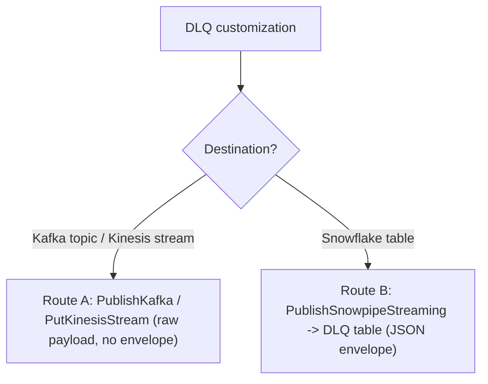
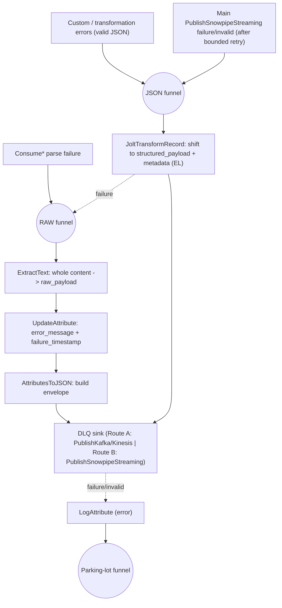

# Streaming Connectors — Dead Letter Queue (DLQ)

## Scope

This reference customizes an **already-installed** streaming connector (Kafka high-performance, Kinesis) **in place** — via nipyapi against the live NiFi instance, following the **inspect-modify-test** cycle (stop flow → add DLQ components → rewire failure relationships → `verify_config` → restart). It routes records that fail processing to a dedicated destination so they are not silently dropped.

**Two destinations, very different complexity:**

- **[Route A — Kafka topic / Kinesis stream](#route-a--kafka-topic--kinesis-stream)** (simplest): re-publish the **original failed payload as-is** to a DLQ topic/stream. **No envelope, no wrapping** — Kafka/Kinesis consumers keep the raw bytes and any error context travels as message headers/attributes. Pick this when a downstream consumer (not Snowflake) will process the failures.
- **[Route B — Snowflake table](#route-b--snowflake-table)**: wrap each failed record into a small JSON **envelope** (`raw_payload` / `structured_payload` + error metadata) and insert it into a DLQ table so it is easy to query. The envelope exists **only** for the table route.

**DLQ complexity scales with what the connector actually contains:**

- A **vanilla / unmodified** high-performance connector has only one failure source — the `Consume*` **parse failure** relationship (currently auto-terminated). For Route B, build a **raw-only DLQ**: capture the unparseable payload as a `raw_payload` string. No JSON/structured handling is needed.
- If the connector has **custom processors** or a `Custom Transformations` process group, those can emit *structured* (valid-JSON) failures. Only then do you offer an additional `structured_payload` branch — **and you must ask the user** whether they want it (see [Step 1](#step-1--inspect-the-installed-connector)).

**Main `PublishSnowpipeStreaming` (PSS) delivery failures — capture them after a bounded retry.** Give the main PSS a *small* `failure` retry count (e.g. `3`) for transient blips, then route its `failure` **and** `invalid` relationships into the **STRUCTURED** DLQ branch (table route) or the DLQ sink (stream route) — the rows the destination table rejected are still valid JSON. Do **not** rely on an effectively-infinite retry (e.g. `9999`): that hides permanent rejects forever and they never reach the DLQ.

> **Snowpipe Streaming has its own server-side error tables.** SSv2 records rejected rows in a managed error table independent of this DLQ — see [Snowpipe Streaming error tables](https://docs.snowflake.com/en/user-guide/snowpipe-streaming/snowpipe-streaming-error-tables). Treat it as a backstop, not a substitute for capturing rejects in your own DLQ. **Note: error tables are not enabled by default** — they must be explicitly enabled per table before Snowflake starts recording rejected rows there.

For data type switching (JSON → Avro/Protobuf):
**Load** `references/connector-streaming-datatypes.md`

For custom transformations (filtering, mapping, routing, defaults, Groovy):
**Load** `references/connector-streaming-transformations.md`

For Snowflake Private Key Auth and overall routing:
**Load** `references/connector-streaming-main.md`

---

## Connector Grounding

Kafka and Kinesis high-performance connectors differ in ways that matter for DLQ wiring. Inspect the actual connector before assuming names.

| Item | Kafka high-performance | Kinesis high-performance |
|------|------------------------|--------------------------|
| Source processor | `ConsumeKafka` | `ConsumeKinesisStream` |
| **Parse-failure relationship** | `parse failure` (space) | `parse.failure` (dot) |
| Error-message attribute on failure | *none* (use a static message) | `record.error.message` (written by the consumer) |
| Connection/credentials to reuse | `Kafka3ConnectionService` | `AWSCredentialsProviderControllerService` + `Region` + `Stream Name` |
| Stream-route publisher | `PublishKafka` | `PutKinesisStream` |
| Record reader / writer | `JsonTreeReader` / `JsonRecordSetWriter` | `JsonTreeReader` / `JsonRecordSetWriter` |
| Destination processor | `PublishSnowpipeStreaming` | `PublishSnowpipeStreaming` |

**⚠️ The parse-failure relationship name differs:** `parse failure` (Kafka, with a space) vs `parse.failure` (Kinesis, with a dot). Using the wrong one fails to create the connection. Always read the relationship names off the actual processor.

**Kinesis has no single "connection service".** A `PutKinesisStream` DLQ publisher reuses the same `AWSCredentialsProviderControllerService` + `Region` as `ConsumeKinesisStream`.

**Error context, where available:** `ConsumeKinesisStream` writes a `record.error.message` FlowFile attribute on parse/serde failure ([docs](https://docs.snowflake.com/en/user-guide/data-integration/openflow/processors/consumekinesisstream)). Use `${record.error.message}` for the `error_message` field on Kinesis. `ConsumeKafka` does **not** write an equivalent attribute, so use a static message (e.g. `"parse failure (unparseable message)"`) for Kafka.

---

## Step 0 — Ask the DLQ Destination

Ask the user where failed records should go:

> "Where should failed records be routed?
> - **Kafka topic / Kinesis stream** — re-publish the failed payload as-is to a messaging destination (simplest; no wrapping)
> - **Snowflake table** — wrap failures in a small JSON envelope and insert them into a dedicated DLQ table (easy to query)"

Then collect names:

- **Topic/stream route ([Route A](#route-a--kafka-topic--kinesis-stream)):** ask for the **topic name** (Kafka) or **stream name** (Kinesis).
- **Snowflake table route ([Route B](#route-b--snowflake-table)):** ask whether the DLQ table lives in the **same database and schema** as the main destination (the default, reusing `Snowflake Destination Database` / `Snowflake Destination Schema`) or a **different** one. Then ask for the **table** name — and, if different, the **database** and **schema** too.



---

## Step 1 — Inspect the Installed Connector

The connector topology determines how many DLQ branches you build (this matters for Route B; Route A always just re-publishes the payload). Inspect the connector process group before adding anything:

1. Switch to the connector's nipyapi profile and resolve the connector process group by name or ID.
2. List all processors in that process group and print each name + type; list child process groups and print their names.

This tells you whether the connector is vanilla or has custom processing (see classification below).

### Processor-creation mechanics

Every "create a processor" step below describes **what** to build (type, name, properties, relationship handling). For the **how** — resolving the processor type, creating the processor, applying config, creating funnels and connections, and setting positions — **Load** `references/author-building-flows.md`. Two specifics that matter throughout this reference:

- **`get_processor_type` may return a list** for ambiguous names (e.g. `PublishKafka`, `JoltTransformRecord`). Select the entry whose type ends with the exact processor name.
- **Dynamic properties** (e.g. the `raw_payload` capture group, `error_message`/`failure_timestamp` attributes) require dynamic-property support when applying config (`allow_dynamic=True` in `prepare_processor_config`).
- **Positions** must be a `layout` helper (`layout.new_flow()`, `layout.below()`) or an `(x, y)` tuple — never a `PositionDTO`.

**Does a DLQ already exist? Audit before building.** If the connector already has DLQ components (funnels, extra `PublishSnowpipeStreaming` sinks, a `LogAttribute`), you are **fixing**, not building. Map every connection and relationship first, then compare against this reference. Common defects to look for:

- Unparseable content (e.g. `ReplaceText`/`ConvertRecord` `failure`, raw CSV/TSV, multi-line text) funneled into a **JSON reader** → re-fails and, if that relationship is auto-terminated, is silently dropped. (Must go through the RAW branch that captures the whole payload as a string.)
- A **line-based** raw reader (e.g. `GrokReader` with `No Match Behavior = raw-line`) used to capture `raw_payload` → **breaks on multi-line payloads** (pretty-printed JSON, multi-line text) because it emits one record per line. Use the whole-content approach in the [raw branch](#raw-branch-always) instead.
- Enrichment or sink `failure` relationships **auto-terminated** → data loss. Every DLQ-branch failure must fall back (to the RAW funnel) or reach the LogAttribute → parking-lot.
- Main PSS `failure` either auto-terminated, set to near-infinite retry, **or** never routed to the DLQ (see [Error Source #3](#3-main-pss-failure--invalid-bounded-retry-then-dlq)).
- Old/outdated `PutSnowpipeStreaming` sink (legacy processor) → replace with `PublishSnowpipeStreaming` using `SNOWFLAKE_MANAGED` auth + the existing web-client service. Current connectors always use `PublishSnowpipeStreaming`.

Classify the connector:

- **Vanilla / unmodified** — only `Consume*` → `PublishSnowpipeStreaming` (no extra processors, no `Custom Transformations` PG). The only failure source is parse failure. For Route B build a **raw-only DLQ** ([raw branch](#raw-branch-always)); do **not** build a structured branch.
- **Has custom processors or a `Custom Transformations` PG** — these can emit structured (valid-JSON) failures. The connector is eligible for a `structured_payload` branch (Route B only), but it is optional. **Ask the user:**

> "I detected custom processing in this connector ({describe: e.g. a 'Custom Transformations' group}). Failures there carry valid JSON, so I can preserve the parsed record in a `structured_payload` (VARIANT) column. Two options:
> - **Raw + structured** — parse failures go to `raw_payload`; transformation failures keep their parsed JSON in `structured_payload`. Richer, slightly more complex flow.
> - **Raw only** — every failure (parse and transformation) is captured as a `raw_payload` string. Simpler flow.
> Which do you prefer?"

- **Raw only** → build only the [raw branch](#raw-branch-always); route every failure source into it.
- **Raw + structured** → build the raw branch **and** the [structured branch](#structured-branch-conditional).

**The raw-vs-structured choice only applies to the Snowflake-table route** — `structured_payload` is a table column. The stream route ([Route A](#route-a--kafka-topic--kinesis-stream)) re-publishes the raw payload regardless.

---

## Error Sources

| # | Source | When | Route A (stream) | Route B (table) |
|---|--------|------|------------------|-----------------|
| 1 | `Consume*` **parse failure** | Always | → DLQ publisher (raw payload) | → RAW branch |
| 2 | Custom processor / `Custom Transformations` PG failure/error | Only if such components exist | → DLQ publisher | → STRUCTURED branch (or RAW if user chose raw-only) |
| 3 | Main `PublishSnowpipeStreaming` `failure` / `invalid` | After a **bounded** retry (e.g. 3) | → DLQ publisher | → STRUCTURED branch (rejected rows are valid JSON) |

### 1. Parse failure (always)

The `Consume*` parse-failure relationship is auto-terminated on a fresh connector. Re-route it to the DLQ. The content is the **raw, unparseable** payload — for Route B it must be captured as a string (never sent through a JSON reader that would re-fail); for Route A it is published as-is.

**Remove the auto-termination before wiring** — you cannot connect a relationship that is still auto-terminated. On the `Consume*` processor, clear `auto_terminated_relationships` (set it to an empty list) while keeping `success` connected to the main destination as before, then apply the config.

Then connect the parse-failure relationship to the DLQ branch (Route B) or publisher (Route A). **Relationship name differs by connector:** `parse failure` (Kafka, space) vs `parse.failure` (Kinesis, dot) — see [Connector Grounding](#connector-grounding).

### 2. Custom-transformation / custom-processor errors (conditional)

Only present if [Step 1](#step-1--inspect-the-installed-connector) found custom components. If a `Custom Transformations` PG exists (see `references/connector-streaming-transformations.md`), add a **second Output Port** on that PG (an error contract), route the relevant `failure`/error relationships of the inner processors to it, and connect it outside the PG to the DLQ. For Route B, wire it into the STRUCTURED branch (raw + structured) or the RAW branch (raw only).

### 3. Main PSS failure / invalid (bounded retry, then DLQ)

Give the main `PublishSnowpipeStreaming` a **small** `failure` retry count (e.g. `retry_count=3`, `retried_relationships=['failure']`) so transient delivery blips self-heal, and auto-terminate only `success`, `empty`. Then wire `failure` **and** `invalid` → the DLQ (STRUCTURED branch for Route B): after the retries are exhausted, a rejected row (still valid JSON) is preserved instead of being lost.

**⚠️ Anti-pattern:** setting the main PSS `failure` retry to `9999` (or auto-terminating `invalid`). Near-infinite retry means a permanently-rejected row loops forever and never reaches the DLQ; auto-terminating `invalid` silently drops it. Bounded-retry-then-DLQ is the correct behavior. (Snowflake's [server-side error tables](https://docs.snowflake.com/en/user-guide/snowpipe-streaming/snowpipe-streaming-error-tables) are an additional backstop.)

---

## Route A — Kafka Topic / Kinesis Stream

The stream route is **deliberately simple: no envelope, no record wrapping.** Connect every failure source directly to a `PublishKafka` (Kafka) or `PutKinesisStream` (Kinesis) sink. The **original failed payload** is published unchanged; a downstream consumer reprocesses it. There is no `GrokReader`, `Jolt`, or metadata step — those belong to the table route only.

> **Subtab navigation (doc):** the broker-specific publisher setup lives in the per-connector pages — **Configuring DLQ handling for Kafka** (`PublishKafka`) and **Configuring DLQ handling for Kinesis** (`PutKinesisStream`). The decision and shared rules are here; follow the matching page for the publisher.

**Why no envelope for Kafka/Kinesis?** The envelope (`raw_payload`/`structured_payload` + metadata) exists so the failures are queryable as columns in a Snowflake table. A messaging destination has no such schema — its consumer wants the original bytes. Wrapping them would force every consumer to unwrap. So Route A publishes the payload as-is and carries error context out-of-band (headers/attributes).

> Before creating any processors, present a summary and ask for approval:
>
> "I will make the following changes to this connector:
> - Add a `PublishKafka` (Kafka) or `PutKinesisStream` (Kinesis) DLQ publisher
> - Re-wire all failure sources (`Consume*` parse-failure; transformation errors; main PSS `failure`/`invalid`) directly to the publisher
> - Add `LogAttribute` → parking-lot funnel for persistent publisher failures
>
> Proceed? (Yes / No / Modify)"

**Inform the user about connection reuse:**

> "The DLQ publisher reuses the same Kafka connection service / AWS credentials as the consumer — i.e., the **same cluster/account**. If your DLQ topic/stream lives on a **different** cluster, you must create a separate connection service (and for a fully separate environment, a separate connector). Otherwise the existing connection is reused."

**Topic/stream name parameter:** add a parameter (e.g. `Kafka DLQ Topic` / `Kinesis DLQ Stream`) and reference it directly:

```
#{'Kafka DLQ Topic'}
```

**Kafka — `PublishKafka`** — create a `PublishKafka` processor named "Publish Failed Records to DLQ Topic" (reuses the source processor's connection service; carries error context as headers):

| Property | Value |
|----------|-------|
| Topic Name | `#{'Kafka DLQ Topic'}` |
| Kafka Connection Service | same ID as `ConsumeKafka` |
| Failure Strategy | `Route to Failure` |
| FlowFile Attribute Header Pattern | `kafka\..*` (propagate original Kafka headers + error attributes as message headers) |

Max concurrent tasks = 1. Auto-terminate `success` only (terminal for a DLQ publisher); route `failure`/`invalid` to the [DLQ sink failure handler](#dlq-sink-failure-handling) so persistent publish failures are **not** silently dropped.

**Kinesis — `PutKinesisStream`** — create a `PutKinesisStream` processor named "Publish Failed Records to DLQ Stream" (reuses the consumer's AWS credentials + region):

| Property | Value |
|----------|-------|
| Amazon Kinesis Stream Name | `#{'Kinesis DLQ Stream'}` |
| AWS Credentials Provider service | same ID as `ConsumeKinesisStream` |
| Region | same region as `ConsumeKinesisStream` |

Max concurrent tasks = 1. Auto-terminate `success` only; route `failure`/`invalid` to the [DLQ sink failure handler](#dlq-sink-failure-handling).

> **`PutKinesisStream` publishes the entire FlowFile content as a single Kinesis message.** If the FlowFile contains multiple records (e.g. NDJSON lines produced by a high-performance connector), each FlowFile will be published as one large blob. To publish individual records, add a `SplitText` processor immediately before `PutKinesisStream` to split the NDJSON into one FlowFile per line first.

**Wiring (both):**

- Connect each failure source (`Consume*` parse-failure; transformation/error relationships; main PSS `failure`/`invalid` after bounded retry) **directly** to this publisher.
- Publisher `failure`, `invalid` → the [DLQ sink failure handler](#dlq-sink-failure-handling); set a **bounded** `failure` retry (e.g. `retry_count=3`) so transient broker issues recover but persistent failures still reach the handler/parking-lot. Do **not** use `9999`.
- FIFO prioritizer on connections (see [Funnels and wiring](#funnels-and-wiring)).

That is the entire stream route. Skip Route B below unless the destination is a Snowflake table.

---

## Route B — Snowflake Table

The table route wraps each failed record in a JSON **envelope** so it can be queried as table columns.

> Before creating any processors, present a summary and ask for approval:
>
> "I will add the following to this connector:
> - RAW branch: `ExtractText` → `UpdateAttribute` → `AttributesToJSON` → `PublishSnowpipeStreaming` ('Ingest Failed Records into DLQ Table', Channel Group `${hostname(false)}.dlq`)
> - (If structured branch requested) `JoltTransformRecord` success → same `PublishSnowpipeStreaming` (both branches share one sink; `raw_payload` set for raw branch, `structured_payload` set for structured branch)
> - RAW funnel (and JSON funnel if structured branch), plus a parking-lot funnel for DLQ publish failures
> - `LogAttribute` to capture any DLQ ingestion errors
>
> Proceed? (Yes / No / Modify)"

### Table setup

**Ask where the DLQ table lives** before anything else:

> "Should the DLQ table live in the **same database and schema** as the main destination, or a **different** one? If different, give me the database and schema to use."

Use the answer for the `CREATE TABLE`, existence check, and the publisher properties below. Propose the default DLQ schema and prompt the user to accept or modify it:

```sql
CREATE TABLE pipeline_dlq (
    error_message      VARCHAR,
    failure_timestamp  TIMESTAMP_NTZ,
    raw_payload        VARCHAR,
    structured_payload VARIANT
);
```

> "I'll use this DLQ table schema. `raw_payload` holds unparseable records; `structured_payload` (VARIANT) holds the parsed JSON when available. Want this as-is, or change it?"

**Keep this full schema even for a raw-only DLQ** — `structured_payload` simply stays null. That way, adding structured handling later requires no table change.

**Check existence, create if missing.** There is no dedicated table-creation skill — use the `snowflake_sql_execute` tool against the connector's Snowflake connection.

```sql
SELECT COUNT(*) FROM <db>.INFORMATION_SCHEMA.TABLES
WHERE TABLE_SCHEMA = '<SCHEMA>' AND TABLE_NAME = '<TABLE>';
```

If it does not exist, ask the user whether to create it, then run the `CREATE TABLE` above. The runtime role needs create/insert grants:

```sql
GRANT USAGE ON DATABASE <db> TO ROLE <execute_as_role>;
GRANT USAGE ON SCHEMA <db>.<schema> TO ROLE <execute_as_role>;
GRANT CREATE TABLE ON SCHEMA <db>.<schema> TO ROLE <execute_as_role>;
```

For grant details, **Load** `references/author-snowflake-destination.md`. For auth setup, **Load** `references/ops-snowflake-auth.md`.

### DLQ envelope fields

Both branches produce the **same envelope fields** so every DLQ row is uniform:

| Field | Type | Raw branch | Structured branch |
|-------|------|------------|-------------------|
| `error_message` | VARCHAR | `${record.error.message}` (Kinesis) or a static message (Kafka) | same |
| `failure_timestamp` | TIMESTAMP_NTZ | `${now():format('yyyy-MM-dd HH:mm:ss.SSS', 'UTC')}` | same |
| `raw_payload` | VARCHAR | the whole original payload as a string | null |
| `structured_payload` | VARIANT | null | the parsed JSON record |

### Add a DLQ parameter

Always add `Snowflake DLQ Table` to the connector's parameter context — **but check first**: many connectors already ship a `Snowflake DLQ Table` parameter (and the destination params). Inspect the bound context before creating anything; if it exists, reuse it. For the database and schema:

- **Same as main destination** (default) → reuse the existing `Snowflake Destination Database` and `Snowflake Destination Schema` parameters in the publisher properties.
- **Different** → add `Snowflake DLQ Database` and/or `Snowflake DLQ Schema` parameters and reference those instead.

Both DLQ publishers share whichever database/schema/table parameters you settle on (**Load** `references/ops-parameters-main.md`).

### Raw branch (always)

Captures any non-JSON / unparseable content into the `raw_payload` string field. This is the **only** branch for a vanilla connector, and the fallback for the structured branch.

**Use a whole-content capture, not a line-based reader.** A line-based reader (e.g. `GrokReader` with `No Match Behavior = raw-line`) emits **one record per line**, so a multi-line payload (pretty-printed JSON, multi-line text) is split into many bogus DLQ rows. Capture the **entire FlowFile content** as a single `raw_payload` value instead. The standard, multi-line-safe pipeline is `ExtractText` (whole content → attribute) → `UpdateAttribute` (error metadata) → `AttributesToJSON` (build envelope) → sink.

**1. `ExtractText`** ("Capture Whole Payload") — create an `ExtractText` processor that copies the entire content into a `raw_payload` attribute using DOTALL so newlines are included:

| Property | Value |
|----------|-------|
| Enable DOTALL Mode | `true` (`.` matches newlines → multi-line safe) |
| Maximum Buffer Size | `10 MB` (raise for large payloads) |
| Maximum Capture Group Length | `10485760` |
| `raw_payload` (dynamic) | `(?s)(.*)` → captures whole content into the `raw_payload` attribute |

Max concurrent tasks = 1. Auto-terminate `unmatched` (matched → next; unmatched dropped).

> For **binary** or very large payloads where attribute capture is impractical, use a one-line `ExecuteGroovyScript` that reads the whole content and writes `{"raw_payload": <json-escaped-content>, ...}` directly. Both approaches preserve multi-line content; `ExtractText` keeps the flow to standard processors.

**2. `UpdateAttribute`** ("Add Raw DLQ Metadata") — create an `UpdateAttribute` processor that sets the shared envelope metadata. `error_message` is hardcoded as a static string for Kafka because `ConsumeKafka` does not write a per-record error attribute. For Kinesis, replace it with `${record.error.message}`.

> **Inform the user:** `error_message` is hardcoded to `'parse failure (unparseable message)'` for Kafka — `ConsumeKafka` does not write a per-record error attribute. If this is a Kinesis connector, substitute `'${record.error.message}'` instead.

| Property (dynamic) | Value |
|----------|-------|
| `error_message` | `parse failure (unparseable message)` (Kafka, hardcoded) — Kinesis: `${record.error.message}` |
| `failure_timestamp` | `${now():format('yyyy-MM-dd HH:mm:ss.SSS', 'UTC')}` |

Max concurrent tasks = 1 (`UpdateAttribute` has only `success`).

**3. `AttributesToJSON`** ("Build Raw DLQ Envelope") — create an `AttributesToJSON` processor that writes the envelope to FlowFile content (values are JSON-escaped automatically):

| Property | Value |
|----------|-------|
| Attributes List | `raw_payload,error_message,failure_timestamp` |
| Destination | `flowfile-content` |
| Include Core Attributes | `false` |
| Null Value | `false` |

Max concurrent tasks = 1. Auto-terminate `failure`.

**4. `PublishSnowpipeStreaming`** ("Ingest Failed Records into DLQ Table") — create a `PublishSnowpipeStreaming` processor; reuse the existing PSS auth/web-client and point at the DLQ table. It reads the envelope via the existing `JsonTreeReader`:

| Property | Value |
|----------|-------|
| Destination Type | `TABLE` |
| Database | `#{Snowflake Destination Database}` (or `#{Snowflake DLQ Database}` if different) |
| Schema | `#{Snowflake Destination Schema}` (or `#{Snowflake DLQ Schema}` if different) |
| Table | `#{Snowflake DLQ Table}` |
| Channel Group | `${hostname(false)}.dlq` |
| Authentication Strategy | `SNOWFLAKE_MANAGED` |
| Connection Strategy | `STANDARD` |
| Web Client Service Provider | existing web-client ID |

Max concurrent tasks = 1. Auto-terminate `success`, `empty`. Route `failure`, `invalid` → the [DLQ sink failure handler](#dlq-sink-failure-handling).

### Structured branch (conditional)

Build **only** when custom components exist and the user opted into structured handling ([Step 1](#step-1--inspect-the-installed-connector)). Preserves the parsed JSON in the `structured_payload` VARIANT column.

**One processor does it all.** The `Jolt Specification` property supports Expression Language, so a single `JoltTransformRecord` both shifts the record under `structured_payload` **and** adds the same envelope metadata — there is no separate "add metadata" `UpdateRecord` step.

**`JoltTransformRecord`** ("Move Payload to structured_payload + Add Metadata") — create a `JoltTransformRecord` processor; reader/writer = existing `JsonTreeReader`/`JsonRecordSetWriter`:

| Property | Value |
|----------|-------|
| Record Reader | existing JSON reader ID |
| Record Writer | existing JSON writer ID |
| Jolt Transform | `jolt-transform-chain` |
| Jolt Specification | the chain below |

The `Jolt Specification` supports Expression Language, evaluated per-FlowFile before the spec is applied. Use a static `error_message` for Kafka; for Kinesis use `${record.error.message}`:

```json
[
  {"operation": "shift",   "spec": {"*": "structured_payload.&"}},
  {"operation": "default", "spec": {
    "error_message": "parse failure (unparseable message)",
    "failure_timestamp": "${now():format('yyyy-MM-dd HH:mm:ss.SSS','UTC')}"
  }}
]
```

(Kinesis: replace the `error_message` value with `${record.error.message}`.)

This yields records shaped exactly like the [raw branch envelope](#dlq-envelope-fields) — `error_message`, `failure_timestamp`, `structured_payload` (and `raw_payload` null). Max concurrent tasks = 1. Auto-terminate `original`. Route `success` → the single `PublishSnowpipeStreaming` ("Ingest Failed Records into DLQ Table") configured in the raw branch; route `failure` → the **raw funnel** (fallback: if structuring fails, still capture the bytes). No separate PSS is needed — both branches produce the same envelope schema and share the same channel group (`${hostname(false)}.dlq`).

### Funnels and wiring

Use **funnels** as merge points so multiple failure sources converge cleanly:

- **RAW funnel** — all unparseable / ser-de-failure sources (parse failure; structured-branch failures) converge here, then flow into `ExtractText` → `UpdateAttribute` → `AttributesToJSON` → the single PSS.
- **JSON funnel** (only if structured branch exists) — custom/transformation failures converge here, then flow into `JoltTransformRecord` → the same single PSS.

**Create the funnels** — a funnel is created against the **process group ID** (`pg.id`, not the PG object) with a `(x, y)` position (or a `layout` helper); it has no name:

- **RAW funnel** — always.
- **JSON funnel** — only if a structured branch exists.

Then connect each failure source to the appropriate funnel, and the funnel onward to the first processor of its branch. A funnel has a single implicit relationship, so connect it onward with no relationship name (e.g. funnel → `ExtractText`).

**ALL connections use the FIFO prioritizer** (`org.apache.nifi.prioritizer.FirstInFirstOutPrioritizer`).

> **Where FIFO actually matters:** ordering is critical on the **main ordered path** (source → transforms → destination) for offset tracking. On DLQ branches the records have already failed, so ordering is not strictly required there — but applying FIFO uniformly is harmless and keeps the rule simple. For the FIFO helper and cross-PG connection patterns (needed when tapping a `Custom Transformations` PG output port), **Load** `references/connector-streaming-transformations.md`.

### DLQ sink failure handling

If even the DLQ publish/insert fails, do not lose the record:

- The DLQ sink `failure`, `invalid` (the `PublishSnowpipeStreaming`, `PublishKafka`, or `PutKinesisStream`) → a `LogAttribute` ("Log DLQ Ingestion Error", Log Level = `error`, prefix e.g. "Failed to ingest data into the DLQ").
- `LogAttribute` `success` → a **parking-lot funnel** where un-deliverable records accumulate for inspection.



For a **raw-only** connector, omit the JSON funnel and structured branch entirely — every source goes to the RAW funnel. For **Route A**, omit the whole envelope (RAW/JSON branches) — every source goes straight to the publisher.

---

## Recover-then-DLQ (rebuild source metadata before rejoining)

Some connectors don't send `parse.failure` straight to the DLQ — they first **attempt recovery** (e.g. `parse.failure` → `ReplaceText` strip control chars → `ConvertRecord` re-parse TSV/CSV → JSON) and rejoin the main path. Only if recovery itself fails does the record go to the DLQ.

**Recovered records bypass the source processor's metadata injection.** `ConsumeKinesisStream` (and `ConsumeKafka`) with `Output Strategy = INJECT_METADATA` adds source metadata (stream/shard/sequence/offset/partition/timestamp) **into** each record on the `success` path. Records rebuilt from raw bytes on the recovery path never went through that injection, so they are **missing those fields** when they rejoin the main transform → the destination table gets inconsistent/incomplete rows (or ingestion fails).

**Fix:** insert an `UpdateRecord` ("Rebuild Kinesis Metadata") on the recovery path, **after** the re-parse and **before** rejoining the main transform, that re-injects the same metadata structure from the FlowFile attributes the source processor set. Reader/writer = existing `JsonTreeReader`/`JsonRecordSetWriter`; `Replacement Value Strategy = literal-value`; add these dynamic record-path properties (Kinesis):

| Record path (dynamic) | Value |
|-----------------------|-------|
| `/kinesisMetadata/stream` | `${aws.kinesis.stream.name}` |
| `/kinesisMetadata/shardId` | `${aws.kinesis.shard.id}` |
| `/kinesisMetadata/partitionKey` | `${aws.kinesis.partition.key}` |
| `/kinesisMetadata/sequenceNumber` | `${aws.kinesis.last.sequence.number}` |
| `/kinesisMetadata/subSequenceNumber` | `${aws.kinesis.last.subsequence.number}` |
| `/kinesisMetadata/shardedSequenceNumber` | `${aws.kinesis.last.sequence.number}${aws.kinesis.last.subsequence.number:padLeft(20, '0')}` |
| `/kinesisMetadata/approximateArrival` | `${aws.kinesis.approximate.arrival.timestamp.ms}` |

Max concurrent tasks = 1 (`success` → main transform; `failure` → structured funnel).

Wire: `ConvertRecord` `success` → `Rebuild Kinesis Metadata` → main transform; `Rebuild Kinesis Metadata` `failure` → the **STRUCTURED** funnel (content is valid JSON by this point). Match the exact metadata field names/paths the connector's success path uses — inspect a successfully-parsed record to confirm the shape. (Kafka connectors inject `kafka.*` attributes; rebuild the connector's own metadata structure accordingly.)

---

## Data Types and JSONL Handling

For the **table route**, `PublishSnowpipeStreaming` expects **JSONL** (one JSON object per line). Failures arrive in different shapes, so route them through the matching branch:

- **Unparseable / non-JSON / multi-line** (parse failure): the [raw branch](#raw-branch-always) captures the **whole FlowFile content** as a single `raw_payload` string (via `ExtractText` DOTALL → `AttributesToJSON`). This is multi-line safe — unlike a line-based reader, it never splits a pretty-printed JSON or multi-line payload into multiple rows.
- **Valid JSON** (downstream/transformation failures): the [structured branch](#structured-branch-conditional)'s single Jolt shift `{"*":"structured_payload.&"}` nests the parsed object under `structured_payload`. On any failure it **falls back to the raw funnel**, so nothing is lost.

**Watch for data-type changes along the flow.** A message may be one type at the source (e.g. CSV/TSV or a malformed line) and a different type after a downstream mapping. Match the capture to the content **at the point of failure** — do not feed raw CSV/TSV into a JSON reader. The whole-content raw branch handles any non-JSON content safely.

For the **stream route** ([Route A](#route-a--kafka-topic--kinesis-stream)) there is no JSONL concern — the original payload bytes are published unchanged.

---

## Step 2 — Verification

After wiring, enable controller services first (processors referencing a DISABLED service show INVALID), then verify.

```python
controllers = nipyapi.canvas.list_all_controllers(pg.id)
for cs in controllers:
    if cs.component.state == 'DISABLED':
        cs = nipyapi.canvas.get_controller(cs.id, identifier_type='id')
        nipyapi.canvas.schedule_controller(cs, True)
```

**Run exactly** (substitute `<profile>` and `<connector-pg-id>`):
```bash
nipyapi --profile <profile> ci verify_config --process_group_id "<connector-pg-id>"
```

See `references/ops-config-verification.md` for interpreting results.

**Check FIFO prioritizer on all DLQ connections.** Every connection you created must use the FIFO prioritizer (`org.apache.nifi.prioritizer.FirstInFirstOutPrioritizer`). Confirm via `nipyapi.canvas.list_all_connections(pg.id)` and check that each connection's `prioritizers` list includes `FirstInFirstOutPrioritizer`. Any connection missing it should be updated before restart.

**Separate wiring failures from environment failures.** `verify_config` checks both your wiring *and* live connectivity, so triage each failure:

- **Wiring failures (fix here):** missing/incorrect connection, wrong relationship name, a processor pointing at a DISABLED controller service, an unparseable-content source routed into a JSON reader. These are defects in what you just built.
- **Environment failures (expected against a non-target account — report, don't chase):** `"The role name provided in the request is invalid"` or unknown database/schema/table when the role/objects live only in the deployment's real target account; `ConsumeKafka`/`ConsumeKinesisStream` failing because the broker/stream is unreachable from this runtime. When doing **flow-only** changes against a test/preprod account, these will fail and that is not a wiring defect — note them and move on.

Confirm the DLQ-specific components you added pass even if the pre-existing sinks/consumer report environment failures.

**⚠️ MANDATORY:** fix all *wiring* failures before declaring complete. Do not restart the flow until the user agrees:

> "All services are enabled and processors validated. The DLQ is wired and ready. Start the flow now?"

---

## Troubleshooting

| Symptom | Likely Cause |
|---------|--------------|
| Connection to parse-failure relationship fails to create | Wrong relationship name — Kafka uses `parse failure` (space), Kinesis uses `parse.failure` (dot). |
| Multi-line payloads (pretty-printed JSON) split into many bogus DLQ rows | A line-based reader (`GrokReader` `No Match Behavior = raw-line`) used for `raw_payload`. Capture the whole content instead (`ExtractText` DOTALL → `AttributesToJSON`, or a Groovy step). |
| `raw_payload` truncated | `ExtractText` `Maximum Buffer Size` / `Maximum Capture Group Length` too small — raise them, or use the Groovy approach for very large/binary payloads. |
| `structured_payload` empty/null in the table | Jolt spec wrong — must be `{"*":"structured_payload.&"}` with `Jolt Transform = jolt-transform-chain` (or `-shift`). |
| `error_message` empty on Kafka | `ConsumeKafka` does not write `record.error.message` — use a static message for Kafka (the attribute only exists on `ConsumeKinesisStream`). |
| DLQ publisher writes to the wrong cluster | Stream-route publisher reuses the source connection service — a different cluster needs a separate connection service. |
| `CREATE TABLE`/insert denied | Missing grants on the DLQ schema (see grants above). |
| Records pile up in the parking-lot funnel | DLQ table/schema mismatch or wrong DB/schema/table parameters — inspect `LogAttribute` error output. |
| DLQ sink fails with "The role name provided in the request is invalid" | Two distinct causes — diagnose before acting. **(a)** The role/database simply does not exist in *this* account (e.g. verifying a connector built for another account) → expected environment failure, report it. **(b)** An outdated `PutSnowpipeStreaming` sink with a hardcoded `Role` → replace it with `PublishSnowpipeStreaming` using `SNOWFLAKE_MANAGED` auth + the existing web-client service. |
| `create_processor` raises `'PositionDTO' object is not subscriptable` | Position arg must be a `layout` helper (`layout.new_flow()`, `layout.below(...)`) or a plain `(x, y)` tuple — not a `PositionDTO`. Ensure `import nipyapi.layout as layout`. |
| `prepare_processor_config` rejects `Log prefix` for `LogAttribute` | The property is `Log Prefix` (capital P). Other static keys: `Log Level`, `Log Payload`, `Output Format`. |
| Need FIFO on a connection but `update_connection`/`create_connection` has no `prioritizers` arg | Those canvas helpers cannot set prioritizers. Use the raw `ProcessGroupsApi().create_connection()` with a full `ConnectionEntity` (`prioritizers=[FIFO]`) — see `references/connector-streaming-transformations.md`. FIFO is optional on DLQ branches anyway. |
| Orphan processors/funnels left after a failed build script | A script that errors mid-way leaves already-created components behind. Before retrying, `list_all_processors`/`list_all_funnels` and delete the partial components, or make the script idempotent (look up by name, create only if absent). |
| Permanently-rejected rows never appear in the DLQ | Main PSS `failure` set to near-infinite retry (e.g. `9999`), or `invalid` auto-terminated. Use bounded retry (e.g. 3) and route `failure`+`invalid` to the structured branch. |
| Recovered (parse-failure → re-parsed) rows missing source metadata in the destination | No metadata-rebuild step on the recovery path — see [Recover-then-DLQ](#recover-then-dlq-rebuild-source-metadata-before-rejoining). |

---

## Next Step

After wiring the DLQ, if you arrived here from the `references/connector-main.md` deployment workflow, **Continue** to `references/connector-main.md` Step 9 (Verify Controllers).

If transformations are also needed, **Load** `references/connector-streaming-transformations.md`.
If a data type change is also needed, **Load** `references/connector-streaming-datatypes.md`.
If Snowflake Private Key Auth is needed, **Load** `references/connector-streaming-main.md`.

Otherwise, the customization is complete.

---

## See Also

- `references/connector-streaming-main.md` — Streaming customization router + Snowflake Private Key Auth
- `references/connector-streaming-datatypes.md` — JSON → Avro/Protobuf data type switching
- `references/connector-streaming-transformations.md` — Filtering, mapping, routing, defaults, Groovy; Custom Transformations PG + cross-PG connections
- `references/connector-kafka.md` — Kafka broker auth customizations (MSK IAM, mTLS)
- `references/connector-main.md` — General connector deployment workflow
- `references/author-snowflake-destination.md` — Snowflake table grants and type mapping
- `references/ops-snowflake-auth.md` — Snowflake key-pair / auth setup
- `references/ops-parameters-main.md` — Parameter configuration
- `references/ops-config-verification.md` — Interpreting `verify_config` results
- `references/author-building-flows.md` — Creating processors, connections, ports (inspect-modify-test)
- [Snowpipe Streaming error tables](https://docs.snowflake.com/en/user-guide/snowpipe-streaming/snowpipe-streaming-error-tables) — server-side rejected-row backstop
