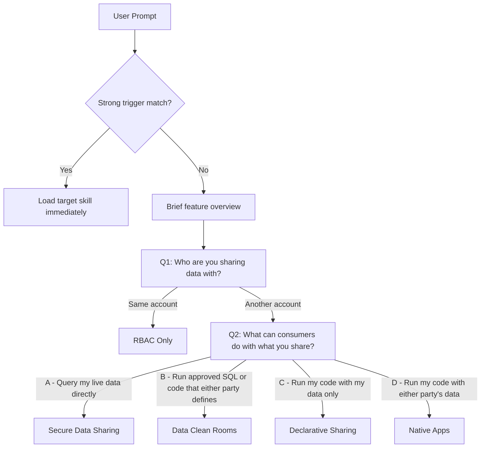

# Sharing Skill

Routes users to the correct Snowflake sharing or collaboration construct based on their intent. When the user's request matches a strong unambiguous trigger, the router loads the target skill immediately. When intent is ambiguous, it asks up to 2 questions to determine the right construct, then hands off with context.

## Routing Diagram


### Mermaid Source



## Path Lengths

| Route | Questions asked |
|-------|----------------|
| RBAC | Q1 (1) |
| Secure Data Sharing | Q1 + Q2 (2) |
| Data Clean Rooms | Q1 + Q2 (2) |
| Native Apps | Q1 + Q2 (2) |
| Declarative Sharing | Q1 + Q2 (2) |

## Question Order Rationale

Q1 routes same-account scenarios to RBAC inline (no sub-skill needed).

Q2 presents all four cross-account options simultaneously as a single neutral question framed around **consumer capability** — not product traits. This eliminates the structural bias of sequential binary questions where whichever product terminates earliest gains an unfair advantage. All four cross-account paths reach a terminal route at depth 2.

## Target Skills

| Construct | Target Skill | When |
|-----------|-------------|------|
| RBAC only | _(handled inline — emits GRANT DDL directly)_ | Same account |
| Secure Data Sharing | [collaboration/data-sharing/SKILL.md](../collaboration/data-sharing/SKILL.md) | Cross-account, Q2 = A |
| Data Clean Rooms | [data-cleanrooms/data-cleanrooms/SKILL.md](../data-cleanrooms/data-cleanrooms/SKILL.md) | Cross-account, Q2 = B |
| Native Apps | [apps/native/SKILL.md](../apps/native/SKILL.md) | Cross-account, Q2 = D |
| Declarative Sharing | [apps/declarative/SKILL.md](../apps/declarative/SKILL.md) | Cross-account, Q2 = C |

## Design Principles

1. **Route only** — the router picks the right sub-skill, nothing else
2. **Neutral framing** — Q2 is framed around consumer capability, not product traits, to avoid structural bias
3. **Sub-skills own boundaries** — if a sub-skill can't handle the content, it explains and offers re-route
4. **No conflict detection** — zero maintenance as features evolve
5. **Context handoff** — pass Q1–Q2 answers so sub-skills don't re-ask

## External Data Prerequisites

External data sources (S3, Azure Blob, GCS, external catalogs) are **orthogonal** to the sharing construct. The router does NOT ask about data source — the target sub-skill handles Iceberg/Openflow setup as a prerequisite when relevant.

## Running Evals

```bash
cd evals
source .venv/bin/activate  # Linux/macOS only
cortex-eval run --config sharing/config.yaml
```

The eval tests routing accuracy across 25 prompts (5 tasks × 5 prompts each) covering all 5 construct paths.
